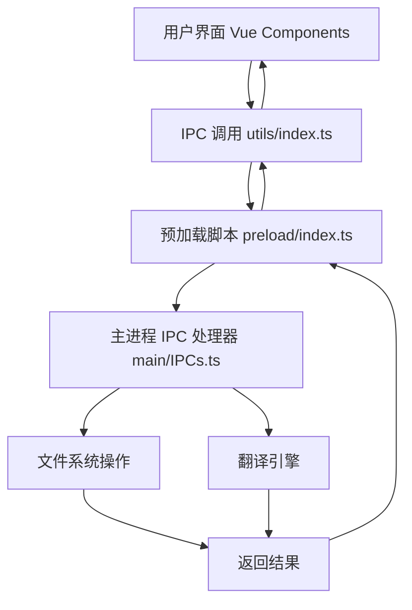

# 开发文档

本文档详细介绍了图片重命名工具的开发环境搭建、架构设计和扩展指南。

## 📋 目录

- [开发环境搭建](#开发环境搭建)
- [项目架构](#项目架构)
- [核心模块](#核心模块)
- [扩展指南](#扩展指南)
- [调试技巧](#调试技巧)
- [性能优化](#性能优化)

## 🛠️ 开发环境搭建

### 系统要求

- **Node.js**: 18.0.0 或更高版本
- **npm**: 8.0.0 或更高版本
- **Git**: 用于版本控制
- **VS Code**: 推荐的开发环境

### 推荐的 VS Code 扩展

```json
{
  "recommendations": [
    "Vue.volar",
    "Vue.vscode-typescript-vue-plugin",
    "bradlc.vscode-tailwindcss",
    "esbenp.prettier-vscode",
    "dbaeumer.vscode-eslint",
    "ms-vscode.vscode-typescript-next"
  ]
}
```

### 环境变量配置

创建 `.env.local` 文件：

```bash
# 开发模式配置
VITE_DEV_SERVER_PORT=5173
VITE_DEV_SERVER_HOST=localhost

# Electron 配置
ELECTRON_ENABLE_LOGGING=true
ELECTRON_ENABLE_SECURITY_WARNINGS=false

# 构建配置
BUILD_TARGET=development
```

## 🏗️ 项目架构

### 目录结构详解

```
vutron/
├── src/
│   ├── main/                   # Electron 主进程
│   │   ├── IPCs.ts            # IPC 通信处理器
│   │   ├── index.ts           # 主进程入口点
│   │   └── utils/             # 主进程工具函数
│   │       └── Constants.ts   # 常量定义
│   ├── preload/               # 预加载脚本
│   │   └── index.ts          # 安全的 IPC 桥接
│   ├── renderer/              # 渲染进程 (Vue 应用)
│   │   ├── screens/          # 页面组件
│   │   │   └── MainScreen.vue # 主界面组件
│   │   ├── locales/          # 国际化文件
│   │   │   ├── zh-hans.json  # 中文简体
│   │   │   └── en.json       # 英文
│   │   ├── plugins/          # Vue 插件配置
│   │   │   ├── i18n.ts       # 国际化插件
│   │   │   ├── pinia.ts      # 状态管理
│   │   │   └── vuetify.ts    # UI 框架
│   │   ├── store/            # Pinia 状态管理
│   │   ├── utils/            # 渲染进程工具函数
│   │   │   └── index.ts      # IPC 调用封装
│   │   ├── App.vue           # 根组件
│   │   ├── main.ts           # 渲染进程入口
│   │   └── index.html        # HTML 模板
│   └── public/               # 静态资源
│       └── images/           # 图片资源
├── buildAssets/              # 构建配置
│   └── builder/              # Electron Builder 配置
├── docs/                     # 项目文档
├── tests/                    # 测试文件
└── dist/                     # 构建输出目录
```

### 数据流架构



## 🔧 核心模块

### 1. IPC 通信模块

**位置**: `src/main/IPCs.ts`

主要功能：

- 文件夹选择和文件扫描
- 中文翻译为英文
- 命名规则应用
- 批量文件重命名

关键方法：

```typescript
// 选择文件夹
ipcMain.handle('msgOpenFolder', async () => { ... })

// 获取文件夹中的图片
ipcMain.handle('msgGetFilesInFolder', async (event, folderPath) => { ... })

// 翻译中文文本
ipcMain.handle('msgTranslateToEnglish', async (event, chineseText) => { ... })

// 应用命名规则
ipcMain.handle('msgApplyNamingConvention', async (event, text, convention) => { ... })

// 执行文件重命名
ipcMain.handle('msgRenameFiles', async (event, operations) => { ... })
```

### 2. 翻译引擎

**依赖库**:

- `pinyin`: 中文拼音转换
- `transliteration`: 通用音译

**翻译流程**:

1. 首先尝试使用 pinyin 进行中文拼音转换
2. 如果失败，使用 transliteration 作为备选
3. 返回最佳翻译结果

### 3. 命名规则处理

支持的命名规则：

- `camelCase`: 小驼峰命名
- `PascalCase`: 大驼峰命名
- `snake_case`: 下划线命名
- `kebab-case`: 短横线命名
- `lowercase`: 全小写命名

### 4. 用户界面组件

**主组件**: `src/renderer/screens/MainScreen.vue`

组件结构：

- 标题区域：应用名称和描述
- 设置区域：命名规则选择、功能开关
- 操作区域：文件夹选择、预览刷新、执行重命名
- 预览区域：重命名结果表格
- 对话框：成功/错误提示

## 🚀 扩展指南

### 添加新的命名规则

1. **更新翻译文件**

在 `src/renderer/locales/zh-hans.json` 中添加：

```json
{
  "naming": {
    "newRule": "新规则名称 (newRule)"
  }
}
```

2. **更新 IPC 处理器**

在 `src/main/IPCs.ts` 的 `msgApplyNamingConvention` 中添加：

```typescript
case 'newRule':
  result = customTransformFunction(result)
  break
```

3. **更新界面选项**

在 `src/renderer/screens/MainScreen.vue` 中添加到 `namingOptions`：

```typescript
{ value: 'newRule', title: t('naming.newRule') }
```

### 添加新的翻译引擎

1. **安装翻译库**

```bash
npm install new-translation-library
```

2. **集成到 IPC 处理器**

在 `src/main/IPCs.ts` 中：

```typescript
import { newTranslationLibrary } from 'new-translation-library'

// 在 msgTranslateToEnglish 中添加
const newResult = await newTranslationLibrary.translate(chineseText)
```

### 添加新的文件格式支持

在 `src/main/IPCs.ts` 的 `msgGetFilesInFolder` 中更新文件扩展名列表：

```typescript
const supportedExtensions = [
  '.jpg',
  '.jpeg',
  '.png',
  '.gif',
  '.bmp',
  '.webp',
  '.svg',
  '.tiff',
  '.ico' // 新增格式
]
```

## 🐛 调试技巧

### 1. 开启 Electron 开发者工具

```bash
# 启动调试模式
npm run dev:debug
```

### 2. 主进程调试

在 `src/main/index.ts` 中添加：

```typescript
if (process.env.NODE_ENV === 'development') {
  console.log('Main process debugging enabled')
}
```

### 3. 渲染进程调试

在 Vue 组件中使用：

```typescript
console.log('Debug info:', data)
```

### 4. IPC 通信调试

在 `src/main/IPCs.ts` 中添加日志：

```typescript
ipcMain.handle('msgOpenFolder', async (event) => {
  console.log('IPC: msgOpenFolder called')
  // ... 处理逻辑
})
```

## ⚡ 性能优化

### 1. 大文件夹处理

对于包含大量文件的文件夹，实现分页加载：

```typescript
const BATCH_SIZE = 100
const batches = []
for (let i = 0; i < files.length; i += BATCH_SIZE) {
  batches.push(files.slice(i, i + BATCH_SIZE))
}
```

### 2. 翻译缓存

实现翻译结果缓存以避免重复翻译：

```typescript
const translationCache = new Map()

if (translationCache.has(chineseText)) {
  return translationCache.get(chineseText)
}

const result = await translate(chineseText)
translationCache.set(chineseText, result)
return result
```

### 3. 异步处理

使用 Web Workers 处理大量文件：

```typescript
// 在渲染进程中
const worker = new Worker('file-processor.worker.js')
worker.postMessage({ files: largeFileList })
```

## 📝 代码规范

### TypeScript 类型定义

```typescript
// 文件信息接口
interface ImageFile {
  name: string
  path: string
  size: number
  modified: Date
}

// 重命名操作接口
interface RenameOperation {
  oldPath: string
  newPath: string
}

// 重命名结果接口
interface RenameResult {
  success: boolean
  oldPath: string
  newPath: string
  error?: string
}
```

### 错误处理模式

```typescript
try {
  const result = await riskyOperation()
  return { success: true, data: result }
} catch (error) {
  console.error('Operation failed:', error)
  return {
    success: false,
    error: error instanceof Error ? error.message : String(error)
  }
}
```

## 🧪 测试指南

### 单元测试

```bash
# 运行测试
npm run test

# 运行测试并生成覆盖率报告
npm run test:coverage
```

### E2E 测试

```bash
# 运行端到端测试
npm run test:e2e
```

### 手动测试清单

- [ ] 应用启动正常
- [ ] 文件夹选择功能
- [ ] 图片文件扫描
- [ ] 翻译功能准确性
- [ ] 各种命名规则
- [ ] 批量重命名功能
- [ ] 错误处理和提示
- [ ] 主题切换
- [ ] 语言切换

---

更多开发相关问题，请参考 [FAQ.md](FAQ.md) 或提交 Issue。
